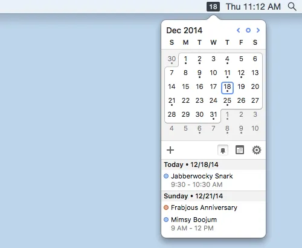
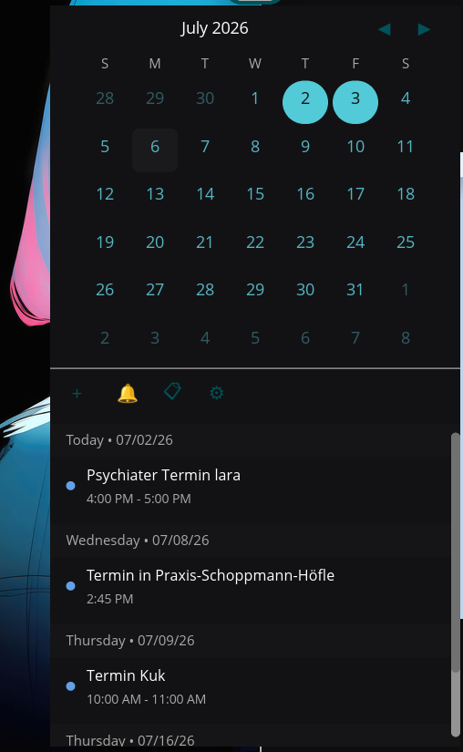

# COSMIC Calenderdot

A calendar applet for the COSMIC desktop with an EDS (Evolution Data Server) backend.





## todos
- [ ] add day seltion in mini calender filter all eventfrom the selectetd da
- [ ] add colo r point for calebder event with event in the mini calender

## Features

- **Panel clock** — shows `%d.%m., %H:%M` in the panel
- **Monthly calendar grid** — day-of-week headers, today highlight, navigation
- **Event agenda** — day-grouped event list with color-coded dots per calendar
- **Toolbar** — create, notifications, view toggle, settings buttons
- **EDS backend** — reads calendar events from Evolution Data Server's SQLite cache
- **Color-coded calendars** — each EDS calendar source gets a stable color from its cache directory hash
- **Live refresh** — detects `cache.db` file changes and reloads events immediately
- **Dark theme** — uses COSMIC dark palette (#121214 background, #52CAD7 accent)

## Build

```sh
cargo build
```

## Install

```sh
sudo just install
```

User-local:

```sh
PREFIX=$HOME/.local just install
```

## Add to Panel

1. Right-click the COSMIC panel → **Panel Settings**
2. Click **Add Applet**
3. Search for **Calenderdot** and click **Add**

Restart the panel if it doesn't appear:

```sh
killall cosmic-panel
```

## Uninstall

```sh
sudo just uninstall
```

### Dependencies

- Rust 2021 edition
- libcosmic (fetched from git during build)
- Evolution Data Server (reads `~/.cache/evolution/calendar/*/cache.db`)
